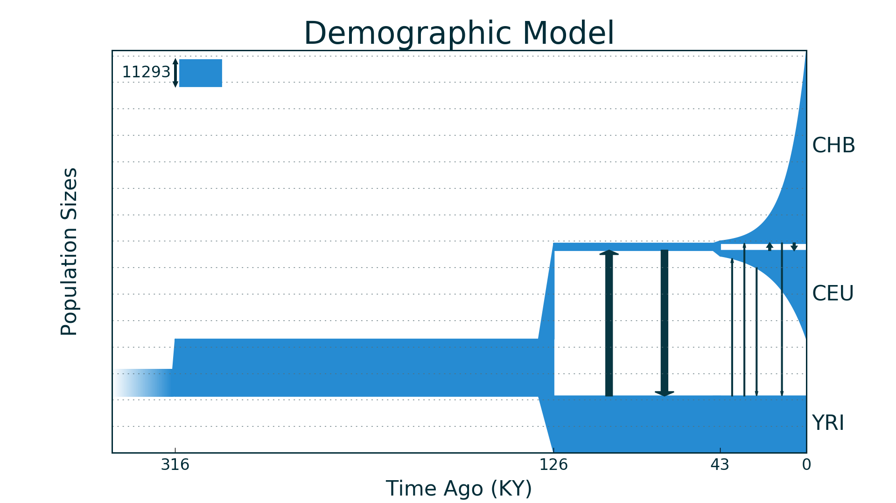
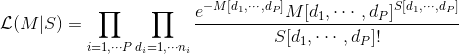
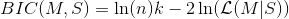

# GADMA 
GADMA implements methods for automatic inferring joint demographic history of multiple populations from genetic data.

GADMA is based on two open source packages: the ∂a∂i developed by Ryan Gutenkunst [https://bitbucket.org/gutenkunstlab/dadi/] and the *moments* developed by Simon Gravel [https://bitbucket.org/simongravel/moments/]. 

In contrast, GADMA is **a command-line tool**. It presents a series of launches of the genetic algorithm and infer demographic history from Allele Frequency Spectrum of multiple populations (up to three). 


GADMA is developed by Ekaterina Noskova (ekaterina.e.noskova@gmail.com)

# Table of contents
- [GADMA](#gadma)
- [Table of contents](#table-of-contents)
- [Dependencies](#dependencies)
- [Installation](#installation)
  * [∂a∂i](#ai)
  * [*moments*](#moments)
  * [GADMA](#gadma-1)
    + [Verifying installation](#verifying-installation)
- [Usage](#usage)
  * [Command line interface](#command-line-interface)
  * [Python package](#python-package)
- [Parameters files](#parameters-files)
  * [Main parameters file](#main-parameters-file)
  * [Extra parameters file](#extra-parameters-file)
- [Input files](#input-files)
- [Output](#output)
  * [Model representation](#model-representation)
  * [Bootstrap analysis](#bootstrap-analysis)
  * [Model drawing](#model-drawing)
  * [Output directory content](#output-directory-content)
- [LogLL (Log likelihood)](#logll-log-likelihood)
- [BIC](#bic)
- [Theta](#theta)
  * [Changing theta](#changing-theta)
- [Structure of demographic model](#structure-of-demographic-model)
- [Resume launch](#resume-launch)

# Dependencies

The absolute dependencies for GADMA are:

* Python (2.5, 2.6, 2.7)
* NumPy (>= 1.2.0)
* Scipy (>= 0.6.0)
* ∂a∂i (>= 1.7.0) **or** *moments* (>= 1.0.0) 

To draw demographic models you have to install:

* matplotlib (>= 0.98.1)
* Pillow (>= 4.2.1)
* *moments* (>= 1.0.0)

# Installation

Before GADMA installation you need either ∂a∂i or *moments* been installed.

## ∂a∂i
To install dadi, go to the work directory and run:
```console
$ git clone https://bitbucket.org/gutenkunstlab/dadi/
```
Then go to the `dadi` directory and install package:
```console
$ cd dadi
$ python setup.py install
```

Now you can check ∂a∂i's installation in python interpreter:
```console
$ python
>>> import dadi
```

## *moments*
To install *moments*, go to the work directory and run:
```console
$ git clone https://bitbucket.org/simongravel/moments/
```
Check that Cython is installed:
```console
$ pip install --upgrade Cython
```
Then go to the `moments` directory and install package:
```console
$ cd moments
$ python setup.py install
```

Now you can check *moments*'s installation in python interpreter:
```console
$ python
>>> import moments
```

## GADMA
To download GADMA, go to the work directory and run:
```console
$ git clone https://github.com/ctlab/GADMA
```
Then go to the `GADMA` directory and install GADMA:
```console
$ cd GADMA
$ python setup.py install
```

Now you can run it like this:
```console
$ gadma --help
```

### Verifying installation

To verify installation you can run test:

```console
$ gadma --test
```

If the installation is successful, you will find the following information at the end:

```console
--Finish bootstrap comparison of result demographic models--

--Finish pipeline--

--Test passed correctly--
Thank you for using GADMA!
```

# Usage
## Command line interface
Now you can use GADMA like command line tool:
```console
$ gadma --help
GADMA version 1.0.0	by Ekaterina Noskova (ekaterina.e.noskova@gmail.com)
Usage: 
	gadma -p/--params <params_file> -e/--extra <extra_params_file>


Instead/With -p/--params and -e/--extra option you can set:
	-o/--output <output_dir>		output directory.
	-i/--input <in.fs>/<in.txt>	input file with AFS or in dadi format.
	--resume <resume_dir>		resume another launch from <resume_dir>.


	-h/--help		show this help message and exit.
	-v/--version		show version and exit.
	--test			run test case.

In case of any questions or problems, please contact: ekaterina.e.noskova@gmail.com
```

## Python package
But it is also possible to use Genetic algorithm from GADMA like ∂a∂i's or *moments*' optimizations: you can find standart YRI_CEU example case for both ∂a∂i and *moments*  in [`examples/YRI_CEU`](https://github.com/ctlab/GADMA/blob/master/examples/YRI_CEU/) directory.

Or you can read `help` for `gadma.Inference.optimize_ga` function:
```python
>>> import gadma
>>> help(gadma.Inference.optimize_ga)
```

# Parameters files
## Main parameters file
GADMA takes file with main pipeline parameters using `-p/--params` option. You can find example parameters file [here](https://github.com/ctlab/GADMA/blob/master/example_params).

You can run example from GADMA installation directory as:
```console
$ gadma -p GADMA/example_params
```

**Note** that all parameters of every launch are saved in `<output_dir>`. So you can find them there and reuse them.

## Extra parameters file
There are also extra parameters, but **you probably do not need them**. You can find their description [here](https://github.com/ctlab/GADMA/blob/master/gadma/extra_params_template).

# Input files

GADMA handles two formats of input files: 
* Frequency spectrum file format (.fs or .sfs)
* SNP data format (.txt)

You can read more about them [here](https://github.com/ctlab/GADMA/blob/master/doc/input_formats.md).

# Output

GADMA prints its progress about every minute in stdout (if not silence parameter is set) and `<output_dir>/GADMA.log` file:

```
[hhh:mm:ss]
All best logLL models:
GA number       logLL            BIC             Model

All best BIC models:
GA number       logLL            BIC             Model

--Best model by log likelihood--
Log likelihood:       	Best logLL
with BIC score:         BIC_score
Model: 	representation of best logLL model

--Best model by BIC score--
Log likelihood:       	logLL
with BIC score:         Best BIC score
Model:  representation of best BIC model  
```

## Model representation

Every model is printed as line of parameters.

All model parameters, except mutation rates, have precision equals to 2.

Our designations: 
* `T` is time, 
* `Ni` is size of population number i, 
* `li` is law of changing of the size of population number i,
* `mij2` is mutation rate from population i to population j.

Model is printed as sequence of periods. Each period is represented as:

* First period (NA - size of ancestry population): 

	```
	[ NA ]
	```
	
* Split: 

	* If we split 1 pop into 2 pops:

	```
	[ Percent of split %, N1, N2]
	```
	
	* If we split 2 pops into 3 pops:

	```
	[ Percent of split %, N1, N2, N3]
	```

* Usual time period:

	* If we have 1 pop:

	```
	[ T, [N1], [l1] ]
	```

	* If we have 2 pops:

	```
	[ T, [N1, N2], [l1, l2], [[None, m12], [m21, None]] ]
	```

	* If we have 3 pops:
	
	```
	[ T, [N1, N2, N3], [l1, l2, l3], [[None, m12, m13], [m21, None, m23], [m31, m32, None]] ]
	```

At the end of the string, that corresponds to the model, there is information about model's ancestry: `c` for model, that is child of crossover, `r` - if it was formed random way, `m` - if it was mutated and `f` - final model of genetic algorithm. 

**Note:** `m` is added as many times as model was mutated.

**Example:**

```
[ [144.38] ][ 0.16%, [23.10, 121.28] ][ 375.77, [143.31, 30.07], [2, 2], [[None, 3.33e-03][7.53e-04, None]] ]	cmm
```

## Bootstrap analysis
GADMA make bootstrap analysis of current best models about every hour.

We sampled our input data, calculate fitness function value of our best models (by logLL and BIC) on it and get mean logLL. It and some other statistics are saved to file `some_statistics` in `<output_dir>`.

GADMA also draws boxplots and best model by mean logLL in `<output_dir>`.

```
--Start bootstrap comparison of result demographic models--
Write statistics to file
Draw boxplots

--Best model by mean logLL:--
Mean Relative Goodness of Fit: 	Best mean logLL
Model:  representation of the model

--Finish bootstrap comparison of result demographic models--
You can find bootstrap comparison of models in output directory.
```

## Model drawing

Every N's iteration (parameter) of each genetic algorithm best model is drawn.

During bootstrap analysis we draw best by mean logLL model.

Models are drawn with *moments* library. In the top left corner there is size of ancestry population. Other parameters are in string representation of the model in log files.



**Note:** You can disable drawing if you ask to draw every **0** iteration.

**Note:** Time units are `Thousand years` usually or `Genetic units`, if you don't specify `-g/--gen_time` option, but you can ask for years in parameters file.

**Note:** You can draw model again with generated python code in `<output_dir>`:

```console
$ python best_logll_model_moments_code.py

```

(It's possible only if you have *moments* installed.)

## Output directory content

For every repeat of Genetic algorithm GADMA create new folder with correspond number.

In every folder there is GADMA_GA.log, where every iteration of algorithm is saved, folders `pictures` and `python_code`. 

When Genetic Algorithm finishes GADMA saves picture and python code of result model in its base folder.

When all GA finishes picture and code of best model among their ones are saved in root directory. Bootstrap results are also saved there.

```
- <output_dir>
	- 1
		GADMA_GA.log
		- pictures
		- python_code
			- dadi
			- moments
		result_model.png
		result_model_code.py
	- 2
		GADMA_GA.log
		- pictures
		- python_code
			- dadi
			- moments
		result_model.png
		result_model_code.py
	params
	extra_params
	GADMA.log
	best_logLL_model.png
	best_logLL_model_dadi_code.py
	best_logLL_model_moments_code.py
	best_bic_model.png
	best_bic_model_dadi_code.py
	best_bic_model_moments_code.py
	some_statistics
	boxplots.png
```

# LogLL (Log likelihood)

∂a∂i and *moments* simulate the allele frequency spectrum `M` from the proposed demographic model as the expected values of Poisson random variables.

For observed spectrum `S` and spectrum `M` for our demographic model, we can calculate likelihood to obtain matrix `S` if  `M` is the expected one:



We compare demographic models by `log(L(M | S))`. It is our fitness function of genetic algorithm.

**Note:** you can simply get `log(L(M | S))` again by running generated python script for model in `<output_dir>`:

```console
$ python best_logLL_model_dadi_code.py
Model log likelihood (LL(model, data)): -276223.285715
```

# BIC

Bayesian Information Criterion is a criterion for model selection. The less BIC is, the better model is.
It is defined as:



where `n` is the number of entries in spectrum.

BIC helps us to find out overfitting of observed spectrum and choose optimal number of parameters of the demographic model.

GADMA remembers best BIC model and shows it for every genetic algorithm.

# Theta
total mutation flux.

It is equal to:


where `μ` - mutation rate per site per generation and `L` - effective sequenced length, which accounts for losses in alignment and missed calls.

**Note: you should estimate `μ` based on generation time.**

You can take generation time equal to 1 year, but don't forget to recalculate `μ`.

>For example (Gutenkunst et al, 2009):

>	We estimate the neutral mutation rate μ using the divergence between human and chimp. Comparing aligned sequences in our data, we estimate the divergence to be 1.13%. Assuming a divergence time of 6 million years and a mean generation time for human and chimp over this interval of 25 years, we have
	
>	μ = 0.0113 · 25 / (2 · 6 · 10^6) = 2.35 × 10^(−8) per generation.

**Some examples of theta:**

|FS file|gen_time| μ | L |theta|Notes|
|:--:|:--:|:--:|:--:|:--:|--|
|YRI_CEU_CHB.fs|25|2.35 × 10^(−8)|4.04 × 10^(6)| 0.37976 | From Gutenkunst et al (2009) |
|YRI_CEU_CHB.fs|24|2.26 × 10^(−8)|4.04 × 10^(6)| 0.36521 | Gen time from Lapierre et al (2017) |
|YRI_CEU_CHB.fs|29|1.44 × 10^(−8)|4.04 × 10^(6)| 0.23270 | From Jouganous et al (2017) |
|YRI_CEU_CHB.fs|24|1.2 × 10^(−8)|4.04 × 10^(6)| 0.19392 | Change gen time from 29 to 24 |

You can find FS files in `fs_examples` directory.

## Changing theta

If you have launched GADMA with one theta and now want to use another, you can simply scale model's parameters:

`a` = `new_theta` / `old_theta`,

* Size of population / `a`,

* Time / `a`,

* Migration rates * `a`,

* Split percent stay the same.

# Structure of demographic model

We represent the demographic model as a sequence of time periods and splits. We will call number of time periods in the case of one population, in the case of two populations - the number of periods before and after a single split, in the case of three populations - the number of periods to the first, between the first and second and after the second split as **structure of the model**.

For example, we observe three populations, at the beginning there was an ancestry population and the time period was one, then a split occurred and there were two populations that changed during two periods, then a split of the second population occurred and now three real populations changed within one time period, the structure of such model will be 1,2,1. 

# Resume launch

To resume interrupted launch you can use `--resume` option or set `Resume from` in parmeters file. You need to set output directory of previous run. 

If output directory isn't setted, GADMA will continue evaluation in the directory: `<previous_output_dir>_resumed`.

**Note** that best by BIC models are lost after resumption. So if you change model's structure, please check best BIC models in both runs.

