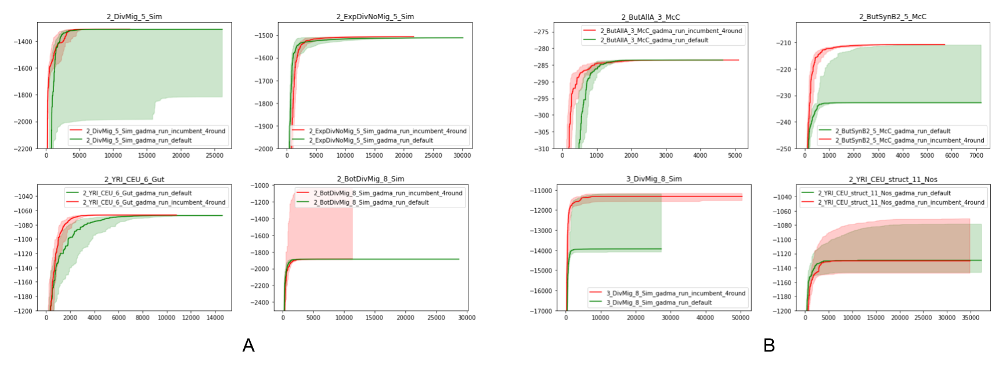

Changelogs
==============

[2.0.0rc19] - 2022-03-18
------------------------

**Major release**

1. We present a new engine - ``momentsLD``!  It is the first engine that use LD statistics for demographic inference in GADMA. For more information please see `documentation <user_manual/set_engine.rst>`__. As in case of the ``momi`` engine if there are some problems with usage of ``momentsLD`` engine please post an issue on GitHub, we really appreciate the feedback!

2. Several bugs were fixed including Issue #58.

[2.0.0rc18] - 2021-09-03
------------------------

**Major release**

1. We present a new engine - ``momi``! It is now possible to perform demographic inference with ``momi`` engine as well as draw pictures of models with it. For more information please see `documentation <user_manual/set_engine.rst>`__. If one will face problems with usage of ``momi`` engine please post an issue on GitHub, we really appreciate the feedback!

2. Option ``Recombination rate`` was added as future engines integrated into GADMA can reqiure it. ALso ``momi`` needs it to simulate data with ``msprime``.

3. New input data - fastsimcoal2 input files. All three engines (``dadi``, ``moments`` and ``momi``) are able to read this format now. For more information about format please see `corresponding section in documentation <user_manual/input_data/obs_data_format.rst>`__.

4. GADMA is now available via ``conda`` (Bioconda).

5. We fix an error in a genetic algorithm that had ignored change of mutation rate and strength of GA. Unfortunately, the hyperparameter optimization that was performed before is no longer valid. We are going to rerun and obtain new hyperparameter values as soon as possible. Right now we change values of mutation rate and strength constants to default values.

6. The distributions of variable sampling were also updated: the time variable will be sampled from log normal distribution (was just normal) and option ``Random NA`` is False by default now. According to the experiments on several datasets GADMA with new distributions performs better.

[2.0.0rc16] - 2021-06-27
------------------------

1. VCF data format was add as one of input data for GADMA! Now SFS data can be build from VCF and popmap files like:

.. code-block:: none

    # param_file
    Input data: vcf_file, popmap_file

2. ``Input file`` setting changed to ``Input data`` option.

2.0.0rc15] - 2021-06-13
------------------------

1. Add Bayesian optimizations to GADMA. There are three versions of it:

  * `GPyOpt_Bayesian_optimization`
  * `SMAC_squirrel_optimization`
  * `SMAC_BO_optimization`

2. Add ``demes`` as a new engine for models plotting.
3. Add ``Inbreeding`` to infer inbreeding coefficients with ``dadi`` engine.
4. Update interface of ``gadma.optimizers``.
5. Move ``Multinom`` option from deprecated options to changed. Add ``Ancestral size as parameter`` instead ``Multinom``.
6. Update docs.

[2.0.0rc13] - 2021-05-21
-------------------------

Local optimizations got hyperparameters from ``dadi`` and ``moments``. Now they work and are efficient the same way as in those packages.

[2.0.0rc9] - 2021-01-27
-------------------------

Prerelease of GADMA v2.0.0.

Code of GADMA was updated in order to make it more stable and accurate. There are tests for implementation and online documentation on ReadTheDocs.
GADMA is now available via ``pip`` and has better optimization algorithm!

**Updated perparameters of genetic algorithm**

We have tuned hyperparameters of the genetic algorithm by Bayesian optimization implemented in `SMAC software <https://github.com/automl/SMAC3>`_.
The following hyperparameters were optimized:

+------------------------------------------+-----------+---------------+
| Hyperparameter                           | Old value | New value     |
+==========================================+===========+===============+
| Mean mutation rate                       | 0.2       | 0.453272      |
+------------------------------------------+-----------+---------------+
| Const_for_mutation_rate                  | 1.2       | 1.068062      |
+------------------------------------------+-----------+---------------+
| Mean mutation strength                   | 0.2       | 0.625049      |
+------------------------------------------+-----------+---------------+
| Const for mutation strength              | 1.1       | 1.016571      |
+------------------------------------------+-----------+---------------+
| Fraction of mutated individuals          | 0.3       | 0.55560528752 |
+------------------------------------------+-----------+---------------+
| Fraction of crossed individuals          | 0.3       | 0.18828153004 |
+------------------------------------------+-----------+---------------+
| Fraction of random generated individuals | 0.2       | 0.12600048532 |
+------------------------------------------+-----------+---------------+

Four different combinations of hyperparameters were optimized with SMAC.
This 4th combination provided the best performance on train and test data.

SMAC was launched for 10,000 iterations in 10 parallel runs for 14 days. Four datasets (instances) were used as training data for optimization. We allowed maximum of 50 runs on each of train instances.

*Picture above shows the comparison of genetic algorithms with different values of hyperparameters on train and test datasets. Green color corresponds to GADMA v1 and red color for GADMA v2. The abscissa axis presents iterations (log-likelihood evaluations), the ordinate refers to the value of log-likelihood. Colored lines correspond to the medians of best log-likelihoods values (50 runs) and shadowed areas are ranges between first (0.25) and third (0.75) quartiles. (A) Convergence on train datasets (B) Convergence on test datasets.*

**Updated options names in parameters file**

Some options in parameters file were changed. Some of them have new names:

    - ``Use moments or dadi`` -> ``Engine``,
    - ``Size of population in ga`` -> ``Size of generation``,
    - ``Fractions in ga`` -> ``Fractions``,
    - ``Epsilon`` -> ``Eps``,
    - ``Stop iteration`` -> ``Stuck generation number``,
    - ``Name of local optimization`` -> ``Local optimizer``,
    - ``Lower bounds`` -> ``Lower bound``,
    - ``Upper bounds`` -> ``Upper bound``,
    - ``Verbose`` option is now both for the genetic algorithm and the local search as verbosity of the output.

It is still possible to use old names - GADMA will successfully read it and print the following warning:

    .. code-block:: console

        UserWarning: Setting `Use moments or dadi` is renamed in 2 version of GADMA to `Engine`. It is successfully read. (/home/build/ctlab/GADMA/gadma/cli/settings_storage.py:741

**Deprecated options names in parameters file**

Some options are deprecated:

    - ``multinom``,
    - ``flush_delay``,
    - ``epsilon_for_ls``,
    - ``gtol``,
    - ``maxiter``,
    - ``multinomial_mutation``,
    - ``multinomial_crossing``,
    - ``distribution``,
    - ``std``,
    - ``mean_mutation_rate_for_hc``,
    - ``const_for_mutation_rate_for_hc``,
    - ``stop_iteration_for_hc``.

    In general those options were in extra parameters file as options of local search algorithms and hill climbing. Hill climbing algorithm if now fully deprecated.

GADMA prints the following warning if some of deprecated options are set in parameters file:

    .. code-block:: console

        UserWarning: Setting `Multinom` was deprecated in 2 version of GADMA. If you have not set it in purpose, ignore this warning. (/home/build/ctlab/GADMA/gadma/cli/settings_storage.py:747)

**New options for mutation rate and sequence length**

    Option ``Theta0`` is required to translate parameters from genetic units. ``Theta0`` is mutation flux equal to ``4 mu L``, where ``mu`` - mutation rate per base per generation and ``L`` - length of sequence. Now it is possible to set mutation rate and sequence length instead of theta0:

    - ``Mutation rate`` - mutation rate per base per generation.
    - ``Sequence length`` - length of sequence that was used to build data.

**New options for migrations**

    New options for migrations. Now migrations could be symmetrical, also some of them could be restricted manually:

    - ``Symmetric migrations`` - if ``True`` then all migrations are symmetrical.
    - ``Migration masks`` - masks for migration matrices for all time intervals with migrations. Consists of 0 and 1, where 0 means that migration is missed and equal to zero.

**Other new options**

    - ``Outgroup`` - new option for data. If ``True`` then data has outgroup and AFS is not folded.
    - ``Split fractions`` - if ``True`` then population is divided into two new according to the fraction which determines the sizes. In such case sum of newly formed populations is equal to size of parent population. If option is ``False`` then each newly formed population has its own independent size.
    - ``Vmin`` - minimal value to draw on heatmap of the AFS data. Is useful when pictures are not good.

    Some additional options for the genetic algorithm (it is equivalent of the ``Fractions``):

    - ``n_elitism`` - number of solutions to take to the new generation.
    - ``p_mutation`` - probability of mutated solution in the new generation.
    - ``p_crossover`` - probability of crossover solution in the new generation
    - ``p_random`` -  probability of random generated solution in the new generation.

**New local search algorithms**

    Now GADMA has full set of local search method for any engine. Hill climbing is deprecated. Other algorithms have new names in additional to those from ``dadi``/``moments``. One could call by one of two names and it will be the same algorithm.

    - L-BFGS-B algorithm is available by names ``L-BFGS-B``, ``optimize_lbfgsb`` and ``L-BFGS-B_log``, ``optimize_log_lbfgsb`` to apply logarithm to search space.
    - BFGS is available under ``BFGS``, ``optimize`` and ``BFGS_log``, ``optimize_log``.
    - Powell's method is available under ``Powell``, ``optimize_powell`` and ``Powell_log``, ``optimize_log_powell``.
    - Nelder-Mead algorithm is available under ``Nelder-Mead``, ``optimize_fmin`` and ``Nelder-Mead_log``, ``optimize_log_fmin``.
    - No local optimization is available under name ``None``.

**New examples**

    - `GADMA run with structure model <https://gadma.readthedocs.io/en/latest/examples/structure_model_example.html>`_,
    - `GADMA run with custom model <https://gadma.readthedocs.io/en/latest/examples/custom_model_example.html>`_,
    - `Usage of function gadma.optimize_ga <https://gadma.readthedocs.io/en/latest/examples/optimize_ga_example.html>`_,
    - `Changing theta after GADMA run <https://gadma.readthedocs.io/en/latest/examples/changing_theta_example.html>`_.

**API**

    - :ref:`Full documentation of GADMA API<api>`.
    - :ref:`Some examples of API usage<api_examples>`
