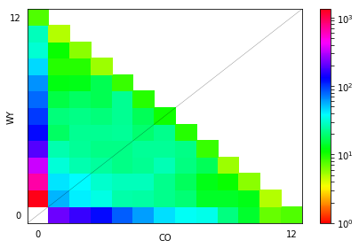
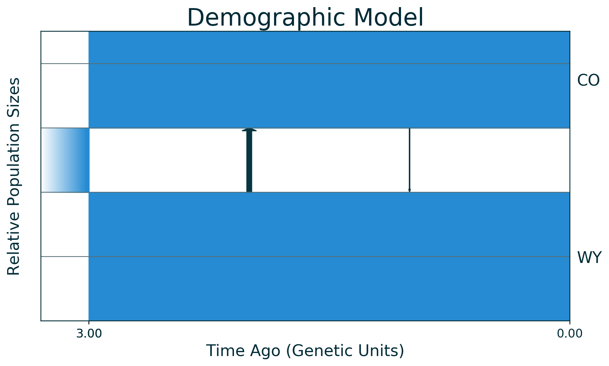
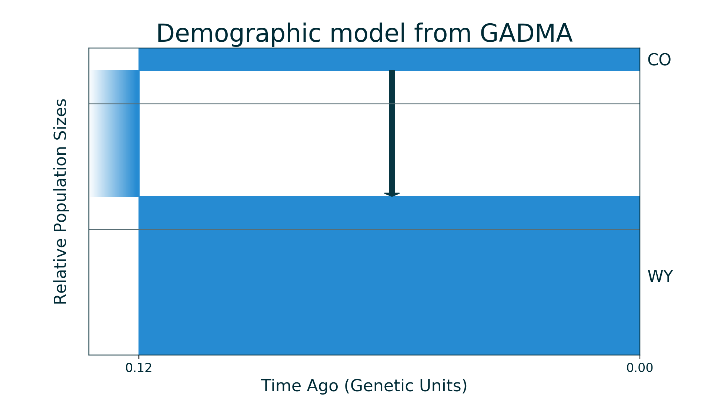

.. _custom_model_example:

GADMA with custom model
=======================

GADMA could be run with a detailed specified demographic model. Model
should be provided as a file with a function ``model_func`` that describes
demographic history by engine itself. It should take values of
parameters and other required arguments and return simulated data for
demographic history with those parameters.

For example, let us use ``moments`` as the engine for demographic inference.
We have data for two populations of Gillette butterfly from `McCoy et al.
2013 <https://onlinelibrary.wiley.com/doi/10.1111/mec.12591>`__ and we
want to estimate demographic history with population split, constant
sizes of populations and asymmetric migrations.

We will need moments to show plots of our data:

.. code:: ipython3

    import moments

Data
----

We have two populations of checkerspot butterfly *Euphydryas gillettii*:

-  WY - native population in Wyoming,
-  CO - population from Colorado.

Folded AFS was built from all SNPs and has a size of 13x13.

.. code:: ipython3

    data = moments.Spectrum.from_file("2pop_e_gillettii_all_snp.fs")
    ns = data.sample_sizes
    moments.Plotting.plot_single_2d_sfs(data, vmin=1.0)


.. parsed-literal::

    /usr/local/lib/python3.6/dist-packages/matplotlib/figure.py:457: UserWarning: matplotlib is currently using a non-GUI backend, so cannot show the figure
      "matplotlib is currently using a non-GUI backend, "





Demographic model
-----------------

Demographic model was built according to the original paper: the ancestral
population of constant size split into two populations of new constant
sizes and there was asymmetric continuous migration between those
populations.

Code of this model is already in file ``demographic_model.py`` and is
written according to ```moments``
manual <https://bitbucket.org/simongravel/moments/src/master/doc/manual/manual.pdf>`__.

.. code:: bash

    %%bash
    cat demographic_model.py


.. parsed-literal::

    import moments
    import numpy as np
    
    def model_func(params, ns):
        nuW, nuC, T, m12, m21 = params
        sfs = moments.LinearSystem_1D.steady_state_1D(sum(ns))
        fs = moments.Spectrum(sfs)
    
        fs = moments.Manips.split_1D_to_2D(fs, ns[0], sum(ns[1:]))
    
        m = np.array([[0, m12], [m21, 0]])
        fs.integrate(Npop=[nuW, nuC], tf=T, m=m, dt_fac=0.1)
        return fs


We could use some random parameters to plot this demographic model:

.. code:: ipython3

    from demographic_model import model_func
    rand_pars = [2, 1.5, 3, 0.1, 1]
    model = moments.ModelPlot.generate_model(model_func, rand_pars, ns)
    moments.ModelPlot.plot_model(model,
                                 pop_labels=['WY', 'CO'],
                                 draw_scale=False,
                                 reverse_timeline=True)





Inference with GADMA
--------------------

To run GADMA with custom model one should set parameters file:

.. code:: bash

    %%bash
    cat params_file


.. parsed-literal::

    # Set data first
    Input file: 2pop_e_gillettii_all_snp.fs
    
    # Some additional settings for data but we do not use them here:
    #
    # Population labels: WY, CO  # we could change order of populations
    # Projections: 10, 10  # downsamples AFS
    # Outgroup: False  # indicates if there is outgroup in data
    
    
    # Output folder. It should be empty.
    Output directory: gadma_result
    
    
    # Set engine for simulations. We use default moments.
    Engine: moments
    
    
    # Now set our custom demographic model from file.
    # There should be a function model_func in the file with the model.
    Custom filename: demographic_model.py
    
    # We could set optional settings about parameter labels,
    # lower and upper bounds. But GADMA can extract it from provided
    # file with model. If it fail then error will be printed and one
    # should set at least parameter labels here.
    #
    # Parameter labels: nuW, nuC, T, m12, m21
    # Lower bound: 1e-2, 1e-2, 1e-15, 0, 0
    # Upper bound: 100, 100, 5, 10, 10
    
    
    # How many repeats to run and how many processes to use.
    Number of repeats: 2
    Number of processes: 2


.. code:: bash

    %%bash
    # As output directory should be empty we remove it if it exists
    rm -rf gadma_result

Now we could run GADMA:

.. code:: bash

    %%bash
    gadma -p params_file


.. parsed-literal::

    --Successful arguments parsing--
    
    Data reading
    Number of populations: 2
    Projections: [12 12]
    Population labels: ['WY', 'CO']
    Outgroup: False
    --Successful data reading--
    
    Parameters of launch are saved in output directory: gadma_result/params_file
    All output is saved in output directory: gadma_result/GADMA.log
    --Start pipeline--
    Run launch number 1
    Run launch number 2
    
    [000:01:00]
    All best by log-likelihood models
    Number	log-likelihood	Model
    Run 1	-286.68	(nuW=1.30539,	nuC=0.22743,	T=0.16273,	m12=0.62013,	m21=0)	c	(theta =  1333.14)
    Run 2	-337.37	(nuW=1.62871,	nuC=0.24435,	T=1.24862,	m12=0.73595,	m21=1.4779)	m	(theta =  962.87)
    
    You can find picture and python code of best model in the output directory.
    
    Finish genetic algorithm number 2
    
    [000:02:00]
    All best by log-likelihood models
    Number	log-likelihood	Model
    Run 1	-282.81	(nuW=1.2634,	nuC=0.18067,	T=0.12439,	m12=0.27997,	m21=0.00e+00)	m	(theta =  1380.39)
    Run 2	-337.22	(nuW=3.65368,	nuC=0.57561,	T=4.98909,	m12=0.33304,	m21=0.61661)	(theta =  421.42)
    
    You can find picture and python code of best model in the output directory.
    
    Finish genetic algorithm number 1
    
    [000:02:30]
    All best by log-likelihood models
    Number	log-likelihood	Model
    Run 1	-282.81	(nuW=1.2634,	nuC=0.18067,	T=0.12439,	m12=0.27997,	m21=0.00e+00)	m	(theta =  1380.39)
    Run 2	-337.22	(nuW=3.65368,	nuC=0.57561,	T=4.98909,	m12=0.33304,	m21=0.61661)	(theta =  421.42)
    
    You can find picture and python code of best model in the output directory.
    
    
    --Finish pipeline--
    
    
    You didn't specify theta at the beginning. If you want change it and rescale parameters, please see tutorial.
    
    Thank you for using GADMA!
    
    In case of any questions or problems, please contact: ekaterina.e.noskova@gmail.com
    


The run was fast because we have a small size of data and a low number of
parameters. Also usually one should run a lot of repeats: we have 2 here
(50 is better for example).

Output directory
----------------

Now let us look at the output directory. Short descriptions:

-  ``1`` - directory with output of first repeat.

   -  ``GADMA_GA.log`` - log of run.
   -  ``current_best_logLL_model_moments_code.py`` - the last best by
      log-likelihood model.
   -  ``final_best_logLL_model_moments_code.py`` - The final best by
      log-likelihood model.
   -  ``eval_file`` - File with all evaluations.
   -  ``save_file`` - File with saved info about run.

-  ``2`` - directory with output of second repeat.
-  ``GADMA.log`` - the output of base run.
-  ``best_logLL_model_moments_code.py`` - result best model.
-  ``best_logLL_model.png`` - picture of best model.
-  ``params_file`` - settings of the base run.
-  ``extra_params_file`` - extra settings of the base run.

.. code:: bash

    %%bash
    tree gadma_result
    # If you do not have tree:
    # ls gadma_result


.. parsed-literal::

    gadma_result
    ├── 1
    │   ├── current_best_logLL_model_moments_code.py
    │   ├── eval_file
    │   ├── final_best_logLL_model_moments_code.py
    │   ├── final_best_logLL_model.png
    │   ├── GADMA_GA.log
    │   └── save_file
    ├── 2
    │   ├── current_best_logLL_model_moments_code.py
    │   ├── eval_file
    │   ├── final_best_logLL_model_moments_code.py
    │   ├── final_best_logLL_model.png
    │   ├── GADMA_GA.log
    │   └── save_file
    ├── best_logLL_model_moments_code.py
    ├── best_logLL_model.png
    ├── extra_params_file
    ├── GADMA.log
    └── params_file
    
    2 directories, 17 files


.. code:: bash

    %%bash
    # GADMA.log contains the same output we have during run. Let us see last lines again:
    tail -n 19 gadma_result/GADMA.log


.. parsed-literal::

    
    [000:02:30]
    All best by log-likelihood models
    Number	log-likelihood	Model
    Run 1	-282.81	(nuW=1.2634,	nuC=0.18067,	T=0.12439,	m12=0.27997,	m21=0.00e+00)	m	(theta =  1380.39)
    Run 2	-337.22	(nuW=3.65368,	nuC=0.57561,	T=4.98909,	m12=0.33304,	m21=0.61661)	(theta =  421.42)
    
    You can find picture and python code of best model in the output directory.
    
    
    --Finish pipeline--
    
    
    You didn't specify theta at the beginning. If you want change it and rescale parameters, please see tutorial.
    
    Thank you for using GADMA!
    
    In case of any questions or problems, please contact: ekaterina.e.noskova@gmail.com
    


Plots
~~~~~

File best\_logLL\_model.png have picture of our best model:

.. code:: ipython3

    from IPython.display import Image
    from IPython.core.display import HTML 
    
    Image("gadma_result/best_logLL_model.png")


.. image:: custom_model_example_files/custom_model_example_17_0.png


Run generated code with final model
~~~~~~~~~~~~~~~~~~~~~~~~~~~~~~~~~~~

We could run the code of final model to get its log-likelihood.

.. code:: bash

    %%bash
    # Show generated code
    cat gadma_result/best_logLL_model_moments_code.py


.. parsed-literal::

    import moments
    import numpy as np
    
    import importlib.util
    
    spec = importlib.util.spec_from_file_location('module', 'demographic_model.py')
    module = importlib.util.module_from_spec(spec)
    spec.loader.exec_module(module)
    model_func = module.model_func
    
    
    data = moments.Spectrum.from_file('2pop_e_gillettii_all_snp.fs')
    ns = data.sample_sizes
    
    p0 = [1.2634029664716868, 0.18066683184484178, 0.12439006690470482, 0.2799706652520448, 0.0]
    model = model_func(p0, ns)
    ll_model = moments.Inference.ll_multinom(model, data)
    print('Model log likelihood (LL(model, data)): {0}'.format(ll_model))
    
    theta = moments.Inference.optimal_sfs_scaling(model, data)
    print('Optimal value of theta: {0}'.format(theta))
    Nanc = None
    
    
    plot_ns = [4 for _ in ns]  # small sizes for fast drawing
    gen_mod = moments.ModelPlot.generate_model(model_func,
                                               p0, plot_ns)
    moments.ModelPlot.plot_model(gen_mod,
                                 save_file='model_from_GADMA.png',
                                 fig_title='Demographic model from GADMA',
                                 draw_scale=False,
                                 pop_labels=['WY', 'CO'],
                                 nref=None,
                                 gen_time=1.0,
                                 gen_time_units='generations',
                                 reverse_timeline=True)

.. code:: bash

    %%bash
    # Run generated code
    python3 gadma_result/best_logLL_model_moments_code.py


.. parsed-literal::

    Model log likelihood (LL(model, data)): -282.8121911840898
    Optimal value of theta: 1380.387312259496


After run of generated code new plot of model is saved to
``model_from_GADMA.png``:

.. code:: ipython3

    Image("model_from_GADMA.png")





