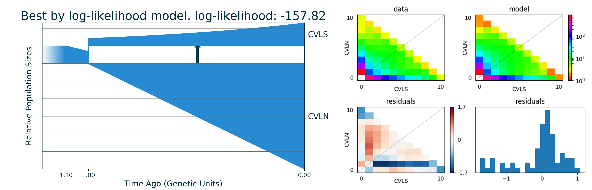

.. _structure_model_example:

GADMA with structure model
==========================

By default GADMA is run for the demographic model with structure. Structure
defines how detailed the demographic model is and GADMA finds all possible
parameters for this model. Here we show how to set structure and use
scheme with increasing structure which provides more stable runs.

.. code:: ipython3

    #We will need dadi to show plots of our data.
    import dadi

Data
----

This data was originally built in paper `Portik et al.
2017 <https://onlinelibrary.wiley.com/doi/abs/10.1111/mec.14266>`__.

We have two populations of Gaboon forest frog *Scotobleps gabonicus*:

-  CVLN
-  CVLS

Folded AFS has a size of 30x18. We have ``.txt`` file with SNP's in SNP's
dadi format:

.. code:: bash

    %%bash
    # First 1- lines of file
    head -10 dadi_2pops_CVLN_CVLS_snps.txt

.. parsed-literal::

    Ingroup	Outgroup	Allele1	CVLN	CVLS	Allele2	CVLN	CVLS	Gene	Position
    -G-	---	G	46	22	A	0	4	1	15
    -A-	---	A	45	26	T	1	0	6	15
    -C-	---	C	45	24	T	1	0	11	15
    -G-	---	G	33	14	T	1	6	12	15
    -G-	---	G	44	26	C	2	0	13	15
    -A-	---	A	45	20	T	1	0	17	15
    -G-	---	G	42	15	A	4	5	22	15
    -C-	---	C	45	26	G	1	0	31	15
    -G-	---	G	39	24	T	1	0	33	15

Demographic model
-----------------

We want to build the demographic model with two time intervals for ancestral
population before split and one time interval after split and asymmetric
migrations. So our ``Final structure`` should be (2, 1). We could use
``Initial structure`` of (1, 1) and then GADMA will first infer
demographic history with (1, 1) structure and then increase it to (2,
1).

Inference with GADMA
--------------------

To run GADMA we should set parameters file:

.. code:: bash

    %%bash
    cat params_file

.. parsed-literal::

    # Set data first
    Input file: dadi_2pops_CVLN_CVLS_snps.txt
    # As we have SNP's file format we need to set the following settings:
    Population labels: CVLN, CVLS
    Projections: 10, 10  # we downsample AFS for fast example 30, 18 original sizes
    Outgroup: False
    
    
    # Output folder. It should be empty.
    Output directory: gadma_result
    
    
    # Set engine for simulations. We use default moments
    Engine: moments
    # But we specify grid size for dadi for its usage in generated code
    Pts: 30, 40, 50
    
    
    # Now set structures
    Initial structure: 1,1
    Final structure: 2,1
    
    # We could specify some additional properties of our model
    # We want asymmetric migrations
    Symmetric migrations: False
    # If True then any population splits into two new in some fraction.
    # If False then two new populations after split have its own initial
    # sizes. We choose the last option.
    Split fractions: False
    
    
    # No output in stdout
    Silence: True
    
    # How many repeats to run and how many processes to use.
    Number of repeats: 2
    Number of processes: 2

.. code:: bash

    %%bash
    # As output directory should be empty we remove it if it exists
    rm -rf gadma_result

Now we could run GADMA:

.. code:: bash

    %%bash
    gadma -p params_file

The run was fast because we downsample our AFS data and and use
``moments`` as engine. Also usually one should run a lot of repeats: we
have 2 here (50 is better for example).

Output directory
----------------

Now let us look at the output directory. Short descriptions:

-  ``1`` - directory with output of first repeat.

   -  ``GADMA_GA.log`` - log of run.
   -  ``current_best_logLL_model_moments_code.py`` - generated code for
      the last best by log-likelihood model and ``moments``.
   -  ``current_best_logLL_model_dadi_code.py`` - generated code for the
      last best by log-likelihood model and ``dadi``.
   -  ``final_best_logLL_model_moments_code.py`` - generated code for
      the final model and ``moments``.
   -  ``final_best_logLL_model_dadi_code.py`` - generated code for the
      final model and ``dadi``.
   -  ``eval_file`` - File with all evaluations.
   -  ``save_file_1_1`` - File with saved info about run for (1,1)
      structure.
   -  ``save_file_2_1`` - File with saved info about run for (2,1)
      structure.

-  ``2`` - directory with output of second repeat.
-  ``GADMA.log`` - the output of base run.
-  ``best_logLL_model_moments_code.py`` - result best model code for
   ``moments``.
-  ``best_logLL_model_dadi_code.py`` - result best model code for
   ``dadi``.
-  ``best_logLL_model.png`` - picture of best model.
-  ``params_file`` - settings of the base run.
-  ``extra_params_file`` - extra settings of the base run.

.. code:: bash

    %%bash
    tree gadma_result
    # If you do not have tree:
    # ls gadma_result

.. parsed-literal::

    gadma_result
    ├── 1
    │   ├── current_best_logLL_model_dadi_code.py
    │   ├── current_best_logLL_model_moments_code.py
    │   ├── eval_file
    │   ├── final_best_logLL_model_dadi_code.py
    │   ├── final_best_logLL_model_moments_code.py
    │   ├── final_best_logLL_model.png
    │   ├── GADMA_GA.log
    │   ├── save_file
    │   ├── save_file_1_1
    │   └── save_file_2_1
    ├── 2
    │   ├── current_best_logLL_model_dadi_code.py
    │   ├── current_best_logLL_model_moments_code.py
    │   ├── eval_file
    │   ├── final_best_logLL_model_dadi_code.py
    │   ├── final_best_logLL_model_moments_code.py
    │   ├── final_best_logLL_model.png
    │   ├── GADMA_GA.log
    │   ├── save_file
    │   ├── save_file_1_1
    │   └── save_file_2_1
    ├── best_logLL_model_dadi_code.py
    ├── best_logLL_model_moments_code.py
    ├── best_logLL_model.png
    ├── extra_params_file
    ├── GADMA.log
    └── params_file
    
    2 directories, 26 files

.. code:: bash

    %%bash
    # GADMA.log contains the same output we have during run. Let us see last lines again:
    tail -n 20 gadma_result/GADMA.log

.. parsed-literal::

    Finish genetic algorithm number 2
    
    [001:03:13]
    All best by log-likelihood models
    Number	log-likelihood	Model
    Run 2	-157.72	[ [ 0.104(t1), [0.684(nu11)], [Lin(dyn11)] ],	[ 1 pop split  [0.027(nu11_1), 0.425(nu11_2)] ],	[ 1.0(t2), [6.008(nu21), 1.305(nu22)], [[0, 0.00e+00(m2_12)], [1.184(m2_21), 0]], [Lin(dyn21), Exp(dyn22)] ] ]	m	(theta =  417.82)
    Run 1	-157.82	[ [ 0.465(t1), [1.0(nu11)], [Sud(dyn11)] ],	[ 1 pop split  [0.027(nu11_1), 0.448(nu11_2)] ],	[ 1.027(t2), [6.156(nu21), 1.317(nu22)], [[0, 0(m2_12)], [1.156(m2_21), 0]], [Lin(dyn21), Exp(dyn22)] ] ]	(theta =  407.99)
    
    You can find picture and python code of best model in the output directory.
    
    
    --Finish pipeline--
    
    
    You didn't specify theta at the beginning. If you want change it and rescale parameters, please see tutorial.
    
    Thank you for using GADMA!
    
    In case of any questions or problems, please contact: ekaterina.e.noskova@gmail.com
    

Plots
~~~~~

File best\_logLL\_model.png have picture of our best model:

.. code:: ipython3

    from IPython.display import Image
    from IPython.core.display import HTML 
    
    Image("gadma_result/best_logLL_model.png")

Run generated code with final model
~~~~~~~~~~~~~~~~~~~~~~~~~~~~~~~~~~~

We could run the code of the final model to get its log-likelihood. In the
case of demographic model with structure, GADMA generates code both for
``dadi`` and ``moments``. We used ``moments`` so let is rerun code of
final model:

.. code:: bash

    %%bash
    # Show generated code
    cat gadma_result/best_logLL_model_moments_code.py

.. parsed-literal::

    import moments
    import numpy as np
    
    def model_func(params, ns):
    	t1, nu11, nu11_1, nu11_2, t2, nu21, nu22, m2_12, m2_21 = params
    	sts = moments.LinearSystem_1D.steady_state_1D(np.sum(ns))
    	fs = moments.Spectrum(sts)
    	nu1_func = lambda t: 1.0 + (nu11 - 1.0) * (t / t1)
    	fs.integrate(tf=t1, Npop=lambda t: [nu1_func(t)], dt_fac=0.01)
    	fs = moments.Manips.split_1D_to_2D(fs, ns[0], ns[1])
    	nu1_func = lambda t: nu11_1 + (nu21 - nu11_1) * (t / t2)
    	nu2_func = lambda t: nu11_2 * (nu22 / nu11_2) ** (t / t2)
    	migs = np.array([[0, m2_12], [m2_21, 0]])
    	fs.integrate(tf=t2, Npop=lambda t: [nu1_func(t), nu2_func(t)], m=migs, dt_fac=0.01)
    	return fs
    
    dd = moments.Misc.make_data_dict('dadi_2pops_CVLN_CVLS_snps.txt')
    data = moments.Spectrum.from_data_dict(dd, ['CVLN', 'CVLS'], [10, 10], polarized=False)
    ns = data.sample_sizes
    
    p0 = [0.10376664756510699, 0.6842060211009087, 0.026658306623565005, 0.4253055557299519, 1.0003743981743454, 6.008416210104161, 1.305377168258428, 0.0, 1.1843358227264176]
    model = model_func(p0, ns)
    ll_model = moments.Inference.ll_multinom(model, data)
    print('Model log likelihood (LL(model, data)): {0}'.format(ll_model))
    
    theta = moments.Inference.optimal_sfs_scaling(model, data)
    print('Optimal value of theta: {0}'.format(theta))
    Nanc = None
    
    
    plot_ns = [4 for _ in ns]  # small sizes for fast drawing
    gen_mod = moments.ModelPlot.generate_model(model_func,
                                               p0, plot_ns)
    moments.ModelPlot.plot_model(gen_mod,
                                 save_file='model_from_GADMA.png',
                                 fig_title='Demographic model from GADMA',
                                 draw_scale=False,
                                 pop_labels=['CVLN', 'CVLS'],
                                 nref=None,
                                 gen_time=1.0,
                                 gen_time_units='generations',
                                 reverse_timeline=True)

.. code:: bash

    %%bash
    # Run generated code
    python3 gadma_result/best_logLL_model_moments_code.py

.. parsed-literal::

    Model log likelihood (LL(model, data)): -157.723240897732
    Optimal value of theta: 417.8151649912695

.. parsed-literal::

    /usr/local/lib/python3.6/dist-packages/moments-1.0.6-py3.6-linux-x86_64.egg/moments/Spectrum_mod.py:1362: FutureWarning: Using a non-tuple sequence for multidimensional indexing is deprecated; use `arr[tuple(seq)]` instead of `arr[seq]`. In the future this will be interpreted as an array index, `arr[np.array(seq)]`, which will result either in an error or a different result.
      slices[pop_ii]

After run of generated code new plot of model is saved to
``model_from_GADMA.png``:

.. code:: ipython3

    Image("model_from_GADMA.png")

.. image:: structure_model_example_files/structure_model_example_19_0.png

And now we could run generated code for ``dadi``, model is the same but
as it is another engine value of log-likelihood will be different.

.. code:: bash

    %%bash
    # Show generated code
    cat gadma_result/best_logLL_model_dadi_code.py

.. parsed-literal::

    import dadi
    import numpy as np
    
    def model_func(params, ns, pts):
    	t1, nu11, nu11_1, nu11_2, t2, nu21, nu22, m2_12, m2_21 = params
    	xx = dadi.Numerics.default_grid(pts)
    	phi = dadi.PhiManip.phi_1D(xx)
    	nu1_func = lambda t: 1.0 + (nu11 - 1.0) * (t / t1)
    	phi = dadi.Integration.one_pop(phi, xx, T=t1, nu=nu1_func)
    	phi = dadi.PhiManip.phi_1D_to_2D(xx, phi)
    	nu1_func = lambda t: nu11_1 + (nu21 - nu11_1) * (t / t2)
    	nu2_func = lambda t: nu11_2 * (nu22 / nu11_2) ** (t / t2)
    	phi = dadi.Integration.two_pops(phi, xx, T=t2, nu1=nu1_func, nu2=nu2_func, m12=m2_12, m21=m2_21)
    	sfs = dadi.Spectrum.from_phi(phi, ns, [xx]*len(ns))
    	return sfs
    
    dd = dadi.Misc.make_data_dict('dadi_2pops_CVLN_CVLS_snps.txt')
    data = dadi.Spectrum.from_data_dict(dd, ['CVLN', 'CVLS'], [10, 10], polarized=False)
    pts = [30, 40, 50]
    ns = data.sample_sizes
    
    p0 = [0.10376664756510699, 0.6842060211009087, 0.026658306623565005, 0.4253055557299519, 1.0003743981743454, 6.008416210104161, 1.305377168258428, 0.0, 1.1843358227264176]
    func_ex = dadi.Numerics.make_extrap_log_func(model_func)
    model = func_ex(p0, ns, pts)
    ll_model = dadi.Inference.ll_multinom(model, data)
    print('Model log likelihood (LL(model, data)): {0}'.format(ll_model))
    
    theta = dadi.Inference.optimal_sfs_scaling(model, data)
    print('Optimal value of theta: {0}'.format(theta))
    Nanc = None

.. code:: bash

    %%bash
    # Run generated code
    python3 gadma_result/best_logLL_model_dadi_code.py

.. parsed-literal::

    Model log likelihood (LL(model, data)): -159.2142532384653
    Optimal value of theta: 419.8896797928062

