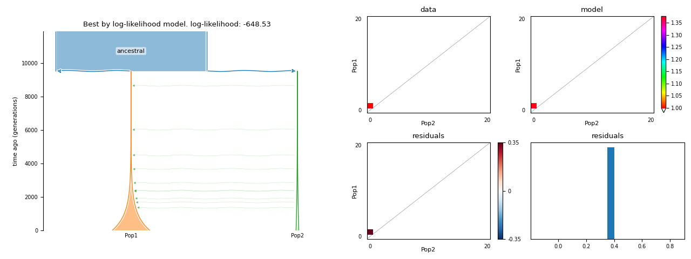
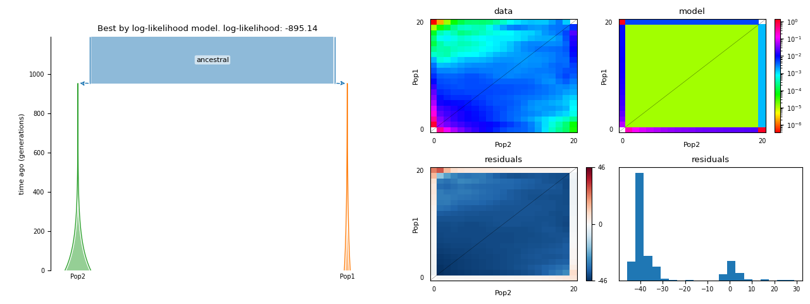

F.A.Q.
==========================

Getting help
------------

If you have any problems or questions, please don't hesitate to contact me by email:
**ekaterina.e.noskova@gmail.com**. I will be glad to answer your questions.

Also you are always welcome to `create an issue <https://github.com/ctlab/GADMA/issues/new>`_ on the `GitHub page <https://github.com/ctlab/GADMA>`_ of GADMA with your question.

How can I get effective length of sequence L?
---------------------------------------------

Value of effective length of the sequence L could be set via ``Sequence length`` option or used to evaluate ``Theta0`` value. What does `effective` mean?

**Answer**:

* Assume total length of sequence that was used for SFS building is equal to ``Nseq``.
* From this data total number of ``X`` SNP's were received.
* But not all of them were used for SFS: some of them (e.g. total number of ``Y`` SNP's) were filtered out.
* Then we should count filtered SNP's and take ``L`` value the following way::

    L = (X - Y) / X * Nseq

What structure of the demographic model is better to use?
---------------------------------------------------------

**Answer**:

Current engine of demographic inference use SFS data which is limited in accuracy.
We should consider limitations of SFS, and because of such behavior, the structure of the demographic model should not be very complex. We suggest using structures no more than (2, 1) and (2, 1, 1). This limitation will be solved in the future by using additional information about observed populations.

There are warnings from dadi and moments during GADMA launch
--------------------------------------------------------------

When GADMA is launched there are a lot of warnings like::

    WARNING:Inference:Model is < 0 where data is not masked.
    WARNING:Inference:Number of affected entries is 100. Sum of data in those entries is 23

**Answer**:

This is warnings from ``moments`` and ``dadi``. They mean that engine had numerical errors during evaluation of log-likelihood value. It is okay to have such warnings during optimization run. However it is worth to check that final model does not have it by :ref:`running its generated code <generated_code>`.

Units of model plot should be in years but they are still in genetic units
---------------------------------------------------------------------------

``Units of time in drawing`` option was set to ``years`` but model plots have time in ``genetic units``.

**Answer**:

Several options are required to translate time of demographic models to physical units (generations, years) from genetic units. Please check that such options are set:

* ``Theta0``

or 

* ``Mutation rate``
* ``Sequence length``

AND if desired units are ``years`` or ``thousand of years`` then time for one generation should be known:

* ``Time for one generation``

If one of those options is missed then plots will be in genetic units.

Plot of my SFS is missed or is empty/blank
-------------------------------------------

Sometimes pictures of SFS plots during GADMA run are missed with the following warning::

    Run 1 warning: failed to draw model due to the following exception: unhashable type: 'MaskedConstant'.

or looks blank:

**Answer**:

GADMA make elements of SFS colored only if its value is greater than ``Vmin`` (be default `1`). First of all clease check that your SFS is allowed to have values less than 1. If so it is possible to change ``Vmin`` option to smaller value (but greater than 0) or set it to ``None`` in order to draw all values.

