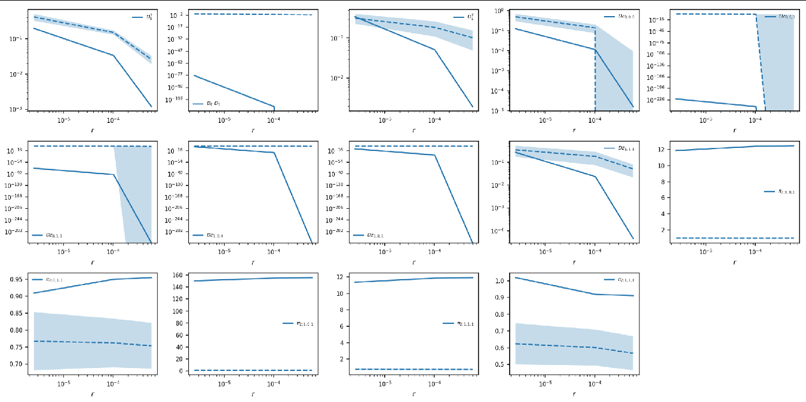

.. _moments_ld_engine:

===========================
momentsLD (additional info)
===========================

.. _precomputing_data:

Precomputing data
-------------------
Parsing LD statistics from an input VCF file is a time-consuming process which is not a main part of the
GADMA genetic algorithm evaluation. If you start GADMA several times, it will spend a lot of time parsing
LD statistics from data. In this case, GADMA has the option of precomputing data before the main process starts.

``gadma-precompute_ld_data`` script reads, precomputes, and saves preprocessed data.
Use this script with the same parameters file as always and GADMA will automatically start data parsing using
a number of processes specified in the parameters file. GADMA will save precomputed data in binary format for further work and update parameters file. The usage is the following:

.. code-block:: console

    GADMA module for data preprocessing with momentsLD engine
    Usage:
    	gadma-precompute_ld_data	-p/--params	<params_file>
    		-e/--extra	<extra_params_file>
    
    
    Instead/With -p/--params and -e/--extra option you can set:
    	-o/--output	<output_dir>		output directory.
    	-i/--input	<in.fs>/<in.txt>/	input data for demographic inference
    			<in.vcf>,<popmap>	(AFS, dadi format or VCF).
    	--resume	<resume_dir>		resume another launch from <resume_dir>.
    	--only_models		flag to take models only from another
    				launch (--resume option).
    
    	-h/--help		show this help message and exit.
    	-v/--version		show version and exit.
    	--test			run test case.
    
    In case of any questions or problems, please contact: ekaterina.e.noskova@gmail.com

How to use your own precomputed data
------------------------------------

You can precompute data on your own using ``moments.LD`` library opportunities. For correct GADMA work, you should save dictionary received after ``moments.LD.Parsing.compute_ld_statistics`` as binary file using ``pickle`` library.
GADMA will read statistics and bootstrap regions from this file.

.. code-block:: none

    # param file
    Input data : ./some.vcf, ./some_popmap
    ...
    preprocessed_data: ./preprocessed_data.bp
    ...

For correct GADMA work please specify the correct VCF file and population map if you use precomputed data. They will not be used for evaluations, but GADMA needs them for correct work (code generation).

Region length and bed files generation
--------------------------------------

Engine ``momentsLD`` requieres bed files that determine regions for LD stats evaluation.
GADMA has a function for the auto-generation of bed files. This bed files subset chromosomes
to equal regions. You can specify region length in the param file.

.. code-block:: none

    # param file
    ...
    region_len: 6400000
    ...

Take in mind that 15 is the minimum quantity of regions for computing LD statistics from data.
If you pass in a length parameter that causes less than 15 regions to be received, it will be ignored.
In the case of fewer regions, we will get a singular matrix during computing LD statistics and subsequent
computation will be impossible. The larger the number of regions, the lower the noise
level in the data. But at the same time, do not forget about the balance between the number of regions and the
length of each individual region. Regions that are too small are also not suitable for work.

.. _rec_maps_ld:

Recombination maps
-------------------

Usually recombination rate for the whole sequence is used in GADMA. In that case recombinations maps for chromosomes are generated automatically. However, it is possible to specify maps directly.

A recombination map - is a genetic map that measures the probability of crossing over at each position
in the genome. As default GADMA takes recombination maps in cM (centiMorgans).
Option ``Recombination maps`` in `params_file` should be set to a directory containing a recombination map for each
chromosome in a VCF file.

.. code-block:: none

    # param file
    ...
    recombinations_maps: ./some_dir
    ...

Files in the given  directory should be names according the following example:

.. code-block:: none

    {map}_{chrom_name}.txt
    Example:
    rec_map_chrom1.txt
    rec_map_chrom2.txt

If you have a few recombination maps united into one file,
each map should have a head name according to the name of chromosome.

Custom demographic model with fixed size of ancestral population
-----------------------------------------------------------------

In automatic GADMA inference with structure the size of ancestral population is inferred
as a parameter of the demographic model.
This value is specific as it is used in ``momentsLD`` engine for ``theta`` (differs from ``moments`` or ``dadi`` and equals to``4 * Ne * mu``) and ``rhos`` evaluations. In case of custom demographic model the size of ancestral population can be fixed. One need to tell GADMA this fixed value via ``Fixed ancestral size`` in `params file`:

.. code-block:: none

    # param file
    ...
    Custom filename: path_to_model_with_fixed_Nanc.py
    fixed_ancestral_size: 10000
    ...

LD keyword arguments
--------------------
It is possible to set several arguments used in computing LD stats for ``momentsLD`` engine.
All of these parameters have default (recomended) values in GADMA: recombination maps with cM units and VCF files containing unphased data.

Default LD kwargs:

.. code-block:: none

    r_bins : np.logspace(-6, -3, 7)
    report: False,
    bp_bins: np.array([ii for ii in range(0, 8275250, 1655050)]),
    use_genotypes: True,
    cM: True

If you want to change some of these arguments you can add to the parameter file ``ld_kwargs``.

.. code-block:: none

    # param file
    ...
    ld_kwargs: {“r_bins”: “np.logspace(-6, -3, 7)”, “report”: True}
    ...

Expressions must be enclosed in ““.

You can find more information about these arguments in the `original documentation of momentsLD <https://moments.readthedocs.io/en/latest/ld/parsing.html>`_.

Plotting LD curves
-------------------
GADMA saves plots of LD statistics during run. You can find them in the output directory.

In the generated code you can find code for LD curves plotting and information about label preparation.
It will help you to plot only the curves you need.
