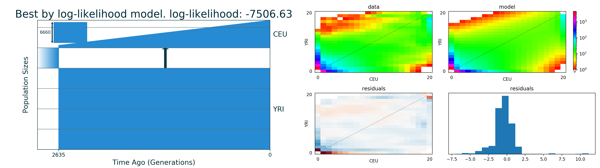
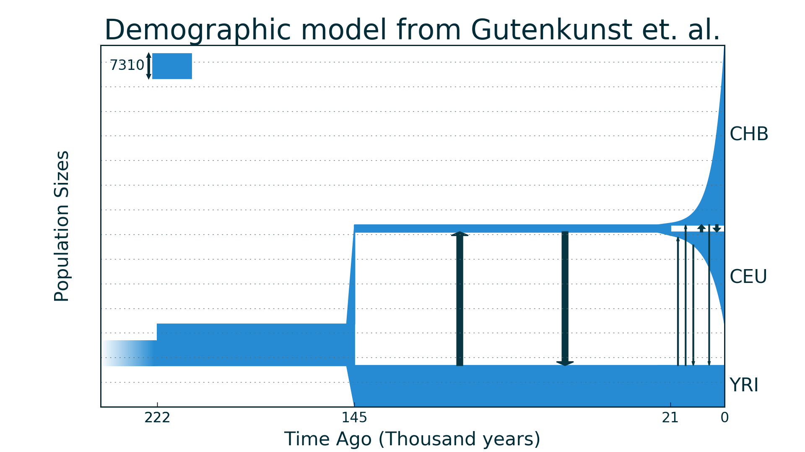

Plotting model
==============

*Example of demographic model plot that GADMA draws during run:*

GADMA always draws final best models during genetic algorithms search for best solutions.

However, models can be drawn during the pipeline every ``N``th iteration of each genetic algorithm. ``N`` is equal to the value of ``Draw models every N iteration`` option in the parameter file. So to enable drawing one should set this option in file.

.. warning::
    Don't draw models very often: changes are usually not very significant and drawing takes some time, so optimization will be slower.

.. note::
    One can disable drawing by setting ``Draw models every N iteration : 0`` in the parameter file. This is also the default behaviour. Final models will be drawn anyway to the base output directory.

Models are drawn with the ``moments`` library, so it should be installed if one wants to have pictures. In the top left corner there is a size of ancestry population. Other parameters one can find in string representation of the model in the log files.

Time units on model plot
---------------------------

Time on the demographic model plot can be drawn in units of years,  thousand years or in genetic units. By default, the choice depends on the ``Time for generation`` option in the parameter file: if it is set to some value (in years) then time will be shown in years, otherwise it will be in genetic units.

But, of course, it is possible to tell GADMA which units are preferable. For example, if one wants time to be in thousands of years on the pictures, as it is a big value in years:

.. code-block:: none

    # param_file
    ...
    Time for generation: 25  # years
    ...
    Units of time in drawing : thousand years
    ...

Plotting after GADMA finished
-------------------------------

*Example of model's plot that was drawn with generated python script:*

Sometimes final pictures aren't satisfying or one didn't draw for some reasons (didn't want to install ``moments``, wanted a fast launch) it is possible to plot demographic model (and only it) again.

To do it one should run the corresponding generated Python script for the model. For example, the final model can be drawn again in the following way:

.. code-block:: console

    $ python best_logll_model_moments_code.py

.. note::
    Again it is possible only if one has ``moments`` installed.

.. note::
    One can change code inside the file and draw again if the picture is not satisfying.

