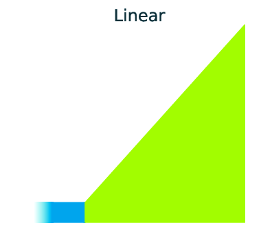
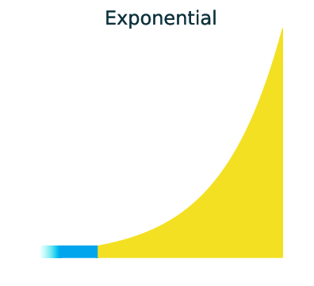
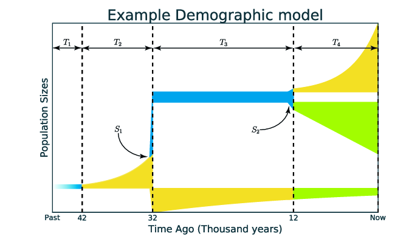

Specifying a model
==================

GADMA could infer two base types of demographic models:

1) Demographic model with structure. Options ``Initial structure`` and/or ``Final structure`` are set and all available parameters are inferred. It is a more flexible model type as dynamics of population size change could be inferred.

2) Custom demographic model as usual in ``dadi`` and ``moments``. Options ``Custom filename`` (+ ``Lower bound``, ``Upper bound``, ``Parameters identifiers``) should be set for this case. Using such a model will give more control over parameters but is less flexible.

Dynamics of population size change
-----------------------------------

*Three main demographic dynamics of population size change:*

.. image:: sudden.png
  :width: 30%

In GADMA the size of population can be changed due to one of three dynamics: sudden change, linear change and exponential change of the effective population size. 

In order to infer a demographic model with sudden changes of populations sizes only, option ``Only sudden`` in the parameters file should be set to ``True``:

.. code-block:: none

   # param_file
   ...
   Only sudden : True
   ...

By default, this option is set to ``False`` and dynamics are found like other parameters of the demographic model.

Specifying model structure
---------------------------------------

GADMA infers a demographic model from an AFS with nothing required from the user, except for simple information that determines how much the detailed model is required - **the structure of the model**.

Assume a division of one population into two new subpopulations and a fixed temporal order of the populations: from the most anciently to the most recently formed population. 

We can divide time of our model into split events and time intervals, during which a certain dynamics of change of effective size is maintained for each population and migration rates are constant. The number of split events is one less than the number of populations under consideration. Now we can define the concept of the structure of the demographic model:

**The structure of the demographic model is**:
    * the number of time intervals in case of one population;
    * the numbers of time intervals before and after a single split, in the case of  two populations;
    * the numbers of time intervals prior to the first split, between the two splits, after the second split, in the case of three populations.

*Example of representation of demographic model. Time is on the axis of abscissa and population size is on the axis of ordinates. The structure of that model is (2,1,1). The colours reflect different demographic dynamics:*

For example, we can divide the time of the model on the figure above to four time intervals: ``T1``, ``T2``, ``T3`` and ``T4``, and two population splits: ``S1`` and ``S2``. The structure of this model is (2, 1, 1) because two intervals (``T1`` as ``T2``) before first split ``S1``, one interval (``T3``) between first and second splits and one interval (``T4``) after second split ``S2``.

Initial structure
*****************

To specify the structure of the inferred model one should set ``Initial structure`` in the parameter file:

.. code-block:: none

    # param_file
    ...
    Initial structure : 2
    ...

or

.. code-block:: none

    # param_file
    ...
    Initial structure : 2,1
    ...

or

.. code-block:: none

    # param_file
    ...
    Initial structure : 2,1,1
    ...

By default the simplest structure is used (1 or 1,1 or 1,1,1).

Final structure
***************

It is also possible to start with a simpler structure in order to get to a more complex one. The runs with different ``Initial structure`` and ``Final structure`` will find models with small number of parameters first and increase that number to achieve final structure. Such pipeline will take more time resources but the result is more stable. To do so one should specify option ``Final structure`` in the parameter file. For example:

.. code-block:: none

    # param_file
    Input file : some_2d_fs.fs
    
    Initial structure : 1,1
    Final   structure : 2,1
    ...

Within this parameter file GADMA will find parameters for demographic model with ``1,1`` structure, then increase the structure to ``2,1`` and find parameters for the model with this structure. Parameters identified within a more simple structure (in this case it is ``1,1``) are used further to define the parameters of a more complex structure ``(2,1)``.

.. note::
    The initial structure is transformed to the final structure in a number of steps, each corresponding to the increment of one component by one. If there is more than one component to increment, the actual incremented component will be selected randomly, so if one specifies initial structure to ``1,1`` and final to ``2,2``, it is not guaranteed to final optimal parameters for demographic models with structures between ``1,1`` and ``2,2``, i.e. intermediate state can be either ``1,2`` or ``2,1``.

.. warning::
    Use the scheme with a more complex structure, as it produces more stable solutions.

.. warning::
    Choose the recommended values for model structure. The final structure should differ from initial structure only by one element , for example, ``1,1`` and ``2,1``; ``1,2,1`` and ``2,2,1``.

Specifying a model in details
----------------------------------

It is also possible to use the genetic algorithm from GADMA to a proposed model that is defined as a Python function using ``dadi`` or ``moments``. It is the way that ``dadi`` and ``moments`` work with demographic models inference. To understand how to specify a model like that one can read manuals to these packages. 

For example, consider a simple bottleneck model for one population: at time ``TF + TB`` in the past, an equilibrium population goes through a bottleneck of depth ``nuB``, recovering to relative size ``nuF``:

.. code-block:: python

    def bottleneck(params, ns, pts):
        nuB, nuF, TB, TF = params
        xx = dadi.Numerics.default_grid(pts)
    
        phi = dadi.PhiManip.phi_1D(xx)
        phi = dadi.Integration.one_pop(phi, xx, TB, nuB) 
        phi = Integration.one_pop(phi, xx, TF, nuF)
    
        fs = dadi.Spectrum.from_phi(phi, ns, (xx,)) 
        return fs

To run optimization from GADMA one needs to run optimization function just like in ``dadi`` and ``moments``:

.. code-block:: python

    # Import GADMA's optimization function:
    import gadma

    # Specify input data and its parameters:
    data = dadi.Spectrum.from_file("fs_filename.fs")
    ns = data.sample_sizes # size of AFS
    pts = [40,50,60] # grid size for dadi

    # Wrap our bottleneck function:
    func_ex = dadi.Numerics.make_extrap_log_func(bottleneck)
    
    # Specify upper and lower bounds for parameters:
    upper_bound = [100, 100, 3, 3]
    lower_bound = [1e-2, 1e-2, 0, 0]
    
    # Run optimizations:
    # Beginning GADMA optimization
    popt = gadma.Inference.optimize_ga(data, func_ex, engine='dadi', args=pts_l,
                                       p_ids = ['nuB', 'nuF', 'TB', 'TF'],
                                       lower_bound=lower_bound,
                                       upper_bound=upper_bound)
    # Beginning local optimization from dadi
    popt = dadi.Inference.optimize_log(popt, data, func_ex, pts_l,
                                       lower_bound=lower_bound,
                                       upper_bound=upper_bound,
                                       verbose=len(p0), maxiter=3)

    print('Found parameters: {0}'.format(popt))

.. note::
    As GADMA optimization is a global search algorithm, no initial parameters ``p0`` are set in ``gadma.Inference.optimize_ga`` function. However, it is possible to specify ``X_init`` with ``p0`` as one of known starting points:

    .. code-block:: python

        # Initial parameters can be set too:
        p0 = [0.01, 1.5, 0.2, 0.2]
    
        # Beginning GADMA optimization
        popt = gadma.Inference.optimize_ga(data, func_ex, engine='dadi', args=pts_l, X_init=[p0], 
                                           p_ids = ['nuB', 'nuF', 'TB', 'TF'],
                                           lower_bound=lower_bound,
                                           upper_bound=upper_bound)
                                       
.. warning::
    Function ``gadma.Inference.optimize_ga`` changed in GADMA version 2. For full documentation see the API (:ref:`gadma.Inference`).

If one wants to find other parameters for ``gadma.Inference.optimize_ga`` function:

.. code-block:: python

    >>> import gadma
    >>> help(gadma.Inference.optimize_ga)

