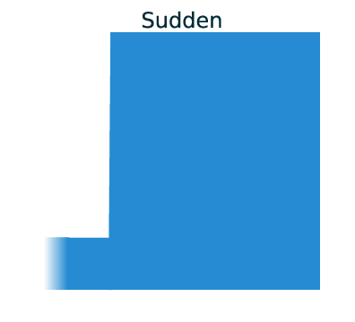

.. _demographic_model_with_structure:

Specifying demographic model with structure
-------------------------------------------

GADMA infers a demographic model from an AFS with nothing required from the user, except for simple information that determines how much the detailed model is required - **the structure of the model**.

.. warning::
    This feature is available only up to three populations. If there is more than three populations then unfortunately only custom model could be used alongside with Bayesian optimization instead of genetic algorithm. More information about demographic inference for four and five populations please see :ref:`here<Dem inference for more than three pops>`.

Assume a division of one population into two new subpopulations and a fixed temporal order of the populations: from the most anciently to the most recently formed population.

We can divide time of our model into split events and time intervals, during which a certain dynamics of change of effective size is maintained for each population and migration rates are constant. The number of split events is one less than the number of populations under consideration. Now we can define the concept of the structure of the demographic model:

**The structure of the demographic model is**:
    * the number of time intervals in case of one population;
    * the numbers of time intervals before and after a single split, in the case of  two populations;
    * the numbers of time intervals prior to the first split, between the two splits, after the second split, in the case of three populations.

*Example of representation of demographic model. Time is on the axis of abscissa and population size is on the axis of ordinates. The structure of that model is (2,1,1). The colours reflect different demographic dynamics:*

.. image:: colored_model.png
    :width: 100%

For example, we can divide the time of the model on the figure above to four time intervals: ``T1``, ``T2``, ``T3`` and ``T4``, and two population splits: ``S1`` and ``S2``. The structure of this model is (2, 1, 1) because two intervals (``T1`` as ``T2``) before first split ``S1``, one interval (``T3``) between first and second splits and one interval (``T4``) after second split ``S2``.

Initial structure
*****************

To specify the structure of the inferred model one should set ``Initial structure`` in the parameter file:

.. code-block:: none

    # param_file
    ...
    Initial structure : 2
    ...

or

.. code-block:: none

    # param_file
    ...
    Initial structure : 2,1
    ...

or

.. code-block:: none

    # param_file
    ...
    Initial structure : 2,1,1
    ...

By default the simplest structure is used (1 or 1,1 or 1,1,1).

Final structure
***************

It is also possible to start with a simpler structure in order to get to a more complex one. The runs with different ``Initial structure`` and ``Final structure`` will find models with small number of parameters first and increase that number to achieve final structure. Such pipeline will take more time resources but the result is more stable. To do so one should specify option ``Final structure`` in the parameter file. For example:

.. code-block:: none

    # param_file
    Input data : some_2d_fs.fs
    
    Initial structure : 1,1
    Final   structure : 2,1
    ...

Within this parameter file GADMA will find parameters for demographic model with ``1,1`` structure, then increase the structure to ``2,1`` and find parameters for the model with this structure. Parameters identified within a more simple structure (in this case it is ``1,1``) are used further to define the parameters of a more complex structure ``(2,1)``.

.. note::
    The initial structure is transformed to the final structure in a number of steps, each corresponding to the increment of one component by one. If there is more than one component to increment, the actual incremented component will be selected randomly, so if one specifies initial structure to ``1,1`` and final to ``2,2``, it is not guaranteed to final optimal parameters for demographic models with structures between ``1,1`` and ``2,2``, i.e. intermediate state can be either ``1,2`` or ``2,1``.

.. warning::
    Use the scheme with a more complex structure, as it produces more stable solutions.

.. warning::
    Choose the recommended values for model structure. The final structure should differ from initial structure only by one element , for example, ``1,1`` and ``2,1``; ``1,2,1`` and ``2,2,1``.

Additional options
******************

Dynamics of size change
_______________________

*Three main demographic dynamics of population size change:*

.. image:: linear.png
  :width: 30%
.. image:: exponential.png
  :width: 30%

In GADMA the size of population can be changed due to one of three dynamics: sudden change, linear change and exponential change of the effective population size. 

In order to infer a demographic model with sudden changes of populations sizes only, option ``Only sudden`` in the parameters file should be set to ``True``:

.. code-block:: none

   # param_file
   ...
   Only sudden : True
   ...

By default, this option is set to ``False`` and dynamics are found like other parameters of the demographic model.

It is also possible to disable some dynamics by setting ``Dynamics`` option to allowed values. For example, to exclude linear size change:

.. code-block:: none

   # param_file
   ...
   Dynamics : Sud, Exp
   ...

Inbreeding
__________

GADMA can estimate inbreeding coefficients for demographic models with structure using ``dadi`` engine. To enable inbreeding coefficients one should set the following:

.. code-block:: none

    # param file
    ...
    Inbreeding: True
    ...

No migrations and symmetric migrations
_______________________________________

GADMA can exclude migrations rates from optimization and consider them equal to zero. In that case all migrations are disabled. One should set option ``No migrations`` to ``True`` in the parameter file.

To estimate symmetric migrations one should set ``Symmetric migrations`` to True.

.. code-block:: none

    # param file
    ...
    No models: False
    Symmetric migrations: True
    ...

Restrict some migrations
__________________________

It is possible to restrict some number of migrations by setting the ``Migration masks`` option. It is a list of masks for each time interval after first split.

For example, if there is model structure equal to (2, 1, 1) and one want to have all zero migrations except (a) migration from population 1 to population 2 between split of ancestral population and second split and (b) migration between population 1 and population 3 after second split. Then for first interval after split mask will be ``[[None, 0], [1, None]]`` (``m[i, j]`` corresponds to the migration from the population ``j`` to the population ``i``) and for next time interval right after the second split mask will be ``[[None, 0, 1], [0, None, 0], [1, 0, None]]``.

.. code-block:: none

    # params_file
    Migration masks: [[[0, 0], [1, 0], [[0, 0, 1], [0, 0, 0], [1, 0, 0]]]

.. note::
    Option ``Migration masks`` is used only in case of demographic model with structure and ``Initial structure`` equal to ``Final structure``.

.. note::
    When option ``Migration masks`` is used together with ``Symmetric migration`` masks should be symmetrical. There is no such option to make some migrations symmetrical and other not.

Selection and dominance coefficients
_____________________________________

To enable inference of selection coefficients in demographic history set option ``Selection`` to ``True``:

.. code-block:: none

    # param file
    ...
    Selection: True
    ...

It is posiible to infer dominance coefficients also:

.. code-block:: none

    # param file
    ...
    Selection: True
    Dominance: True
    ...

Split fractions
__________________

Split could be set in two ways:

1) Population is split according to some ``fraction``: ``size * fraction`` becomes size of first subpopulation and ``size * (1 - fraction)`` becomes the size of the second subpopulation. In this case sizes of newly formed populations could not be greater than the size of their parent population.

2) Sizes of newly formed subpopulations are independent from the size of the parent population. In that case the demographic model will have one additional one parameter per each split in it compared to the model from the first point.

.. code-block:: none

    # param file
    Split fractions: True  # for 1) point

Upper bound of split
_____________________

To limit time of some split one should specify an option in the parameter file. Splits are numbered from the most ancient. So split 1 is split that occurred with the ancient population and split 2 is the next division of the second population (exist only for three populations). There are two appropriate options: ``Upper bound of first split`` and ``Upper bound of second split``.

One should translate time from years into genetic units, therefore divide it by ``2 * T_g``, where ``T_g`` is time (in years) for one generation. For example, one wants to limit the last split to 2000 years. Time for one generation is estimated as 24 years, then one should specify in the parameter file:

.. code-block:: none

    # param_file
    ...
    Upper bound of second split : 41.666
    ...
