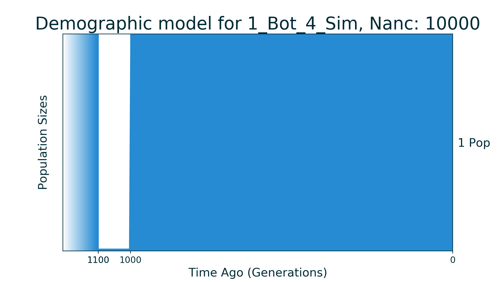
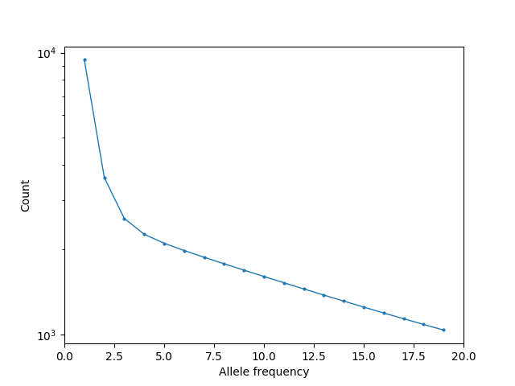

## 1_Bot_4_Sim

| Number of populations | Number of parameters | Max log likelihood | Size of spectrum |
| --- | --- | --- | --- |
| 1 | 4 | -88.560 | 20 |

### Model Description

Classical one population bottleneck model.

### Plots

Schematic model plot:

Simulated allele frequency spectrum:

### Optimal parameter values

| Parameter | Value | Description |
| --- | --- | --- |
| `nuB` | 0.010 | Size of population during bottleneck. |
| `nuF` | 1.000 | Size of population now. |
| `tB` | 0.005 | Time of bottleneck duration. |
| `tF` | 0.050 | Time after bottleneck finished. |

