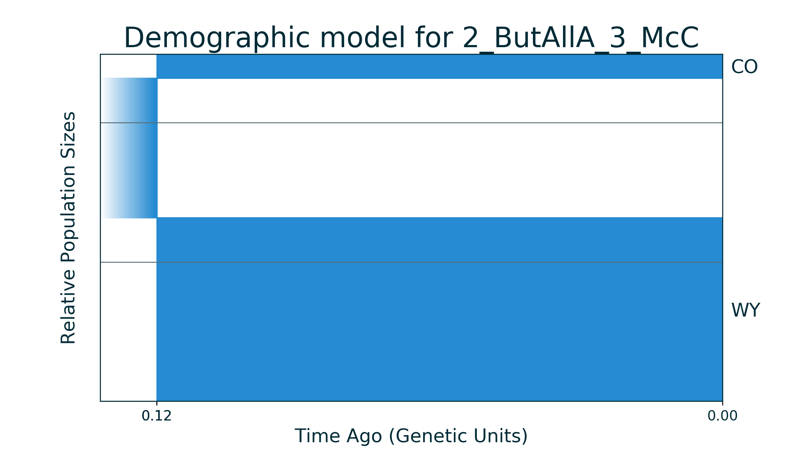
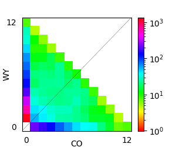

## 2_ButAllA_3_McC

| Number of populations | Number of parameters | Max log likelihood | Size of spectrum |
| --- | --- | --- | --- |
| 2 | 3 | -283.599 | 12x12 |

### Model Description

Demographic model without migration for two populations of butterflies. Data and model are from McCoy et al. 2013. Model is very simple: ancestral population splits into two new populations of constant size.

### Plots

Schematic model plot:

Simulated allele frequency spectrum:

### Optimal parameter values

| Parameter | Value | Description |
| --- | --- | --- |
| `nuW` | 1.320 | Size of first subpopulation. |
| `nuC` | 0.173 | Size of second subpopulation. |
| `T` | 0.117 | Time of ancestral population split. |

