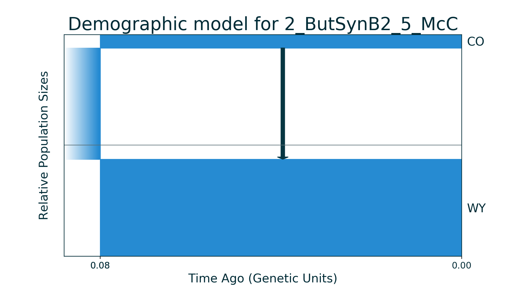
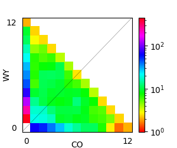

## 2_ButSynB2_5_McC

| Number of populations | Number of parameters | Max log likelihood | Size of spectrum |
| --- | --- | --- | --- |
| 2 | 5 | -210.769 | 12x12 |

### Model Description

Demographic model with asymmetric migrations for two populations of butterflies. Data and model are from McCoy et al. 2013. Ancestral population split into two new formed populations with following continuous migrations between them.

### Plots

Schematic model plot:

Simulated allele frequency spectrum:

### Optimal parameter values

| Parameter | Value | Description |
| --- | --- | --- |
| `nuW` | 0.873 | Size of first new formed population. |
| `nuC` | 0.121 | Size of second new formed population. |
| `T` | 0.080 | Time of ancestral population split. |
| `m12` | 0.923 | Migration rate from second population to first one. |
| `m21` | 0.000 | Migration rate from first population to second one. |

