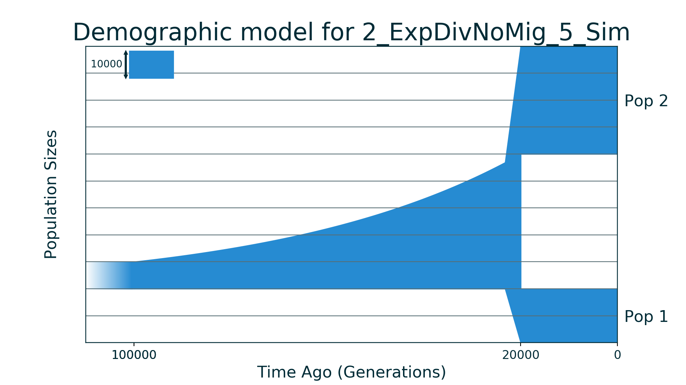
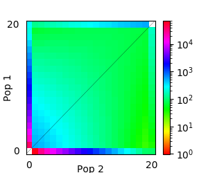

## 2_ExpDivNoMig_5_Sim

| Number of populations | Number of parameters | Max log likelihood | Size of spectrum |
| --- | --- | --- | --- |
| 2 | 5 | -1503.119 | 20x20 |

### Model Description

Demographic model of isolation for two populations with exponential growth of an ancestral population followed by split.

### Plots

Schematic model plot:

Simulated allele frequency spectrum:

### Optimal parameter values

| Parameter | Value | Description |
| --- | --- | --- |
| `nu` | 5.000 | Size of ancestral population after exponential growth. |
| `nu1` | 2.000 | Size of population 1 after split. |
| `nu2` | 4.000 | Size of population 2 after split. |
| `T1` | 4.000 | Time between exponential growth of ancestral population and its split. |
| `T2` | 1.000 | Time of ancestral population split. |

