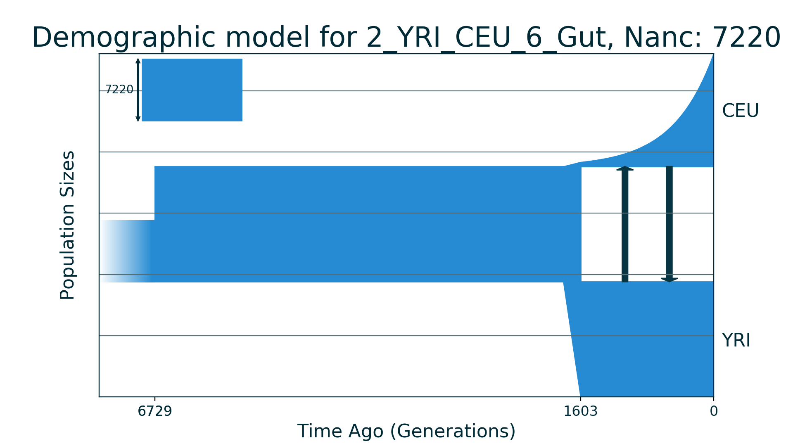

## 2_YRI_CEU_6_Gut

| Number of populations | Number of parameters | Max log likelihood | Size of spectrum |
| --- | --- | --- | --- |
| 2 | 6 | -1066.823 | 20x20 |

### Model Description

Demographic model for two modern human populations: YRI and CEU. Data and model are from Gutenkunst et al., 2009. Model with sudden growth of ancestral population size, followed by split, bottleneck in second population (CEU) with exponential recovery and symmetric migration.

### Plots

Schematic model plot:

Simulated allele frequency spectrum:

### Optimal parameter values

| Parameter | Value | Description |
| --- | --- | --- |
| `nu1F` | 1.881 | The ancestral population size after growth. |
| `nu2B` | 0.071 | The bottleneck size for second population (CEU). |
| `nu2F` | 1.845 | The final size for second population (CEU). |
| `m` | 0.911 | The scaled symmetric migration rate. |
| `Tp` | 0.355 | The scaled time between ancestral population growth and the split. |
| `T` | 0.111 | The time between the split and present. |

