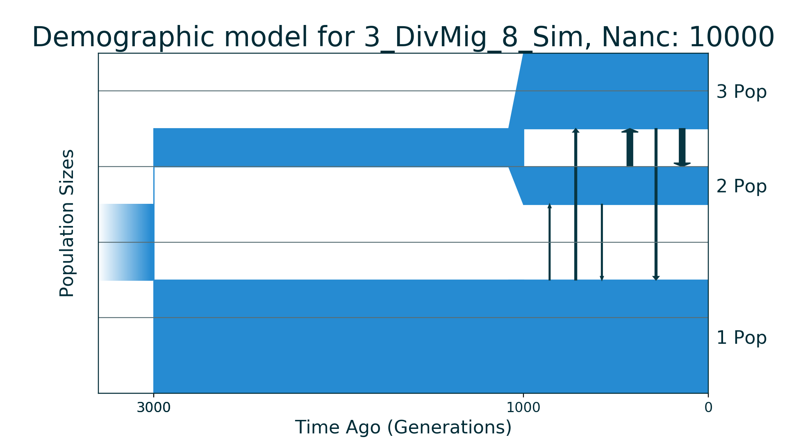
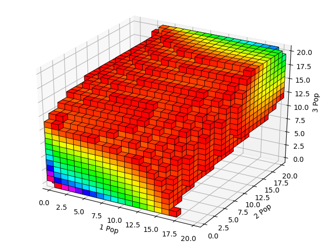
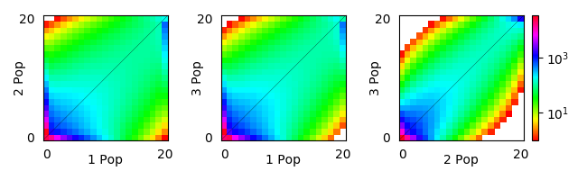

## 3_DivMig_8_Sim

| Number of populations | Number of parameters | Max log likelihood | Size of spectrum |
| --- | --- | --- | --- |
| 3 | 8 | -11178.277 | 20x20x20 |

### Model Description

Three populations demographic history with small number of parameters. In the model ancestral population is split into population 1 and population 2, each of which had constant size till now days. Population 3 is formed by split from population 2 without change of its size and had constant size till now too. Migration rates are symmetrical.

### Plots

Schematic model plot:

Simulated allele frequency spectrum:

Simulated allele frequency spectrum (projections):

### Optimal parameter values

| Parameter | Value | Description |
| --- | --- | --- |
| `nu1` | 1.500 | Size of population 1. |
| `nu2` | 0.500 | Size of population 2. |
| `nu3` | 1.000 | Size of population 3 after split from population 2. |
| `m12` | 0.500 | Migration rate between population 1 and population 2. |
| `m13` | 1.000 | Migration rate between population 1 and population 3. |
| `m23` | 3.000 | Migration rate between population 2 and population 3. |
| `T1` | 0.100 | Time between ancestral population split and divergence of population 3 from population 2. |
| `T2` | 0.050 | Time of population 3 divergence from population 2. |

