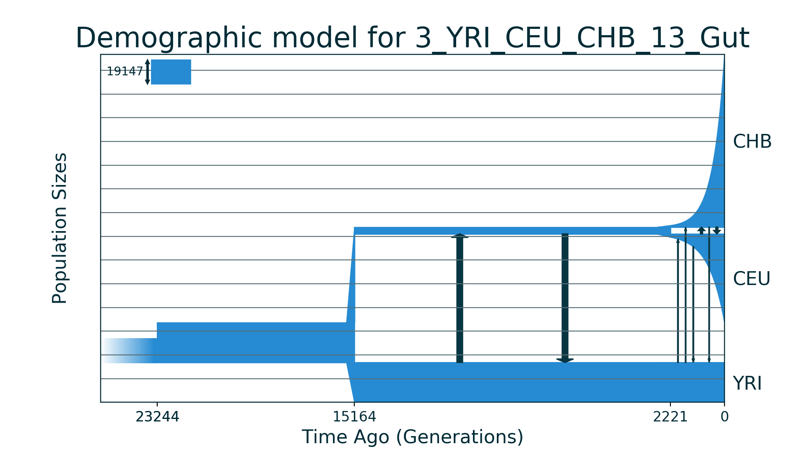
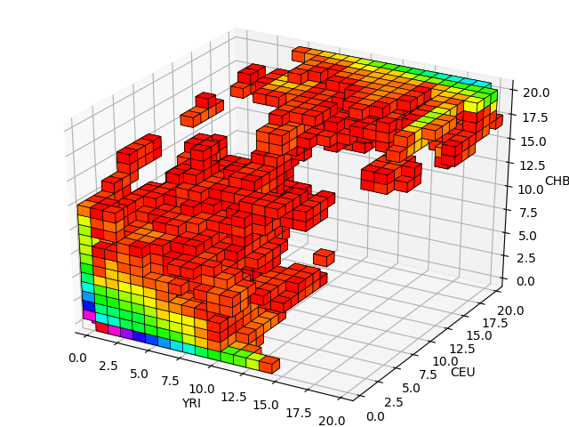
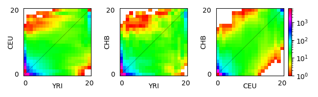

## 3_YRI_CEU_CHB_13_Gut

| Number of populations | Number of parameters | Max log likelihood | Size of spectrum |
| --- | --- | --- | --- |
| 3 | 13 | -6316.578 | 20x20x20 |

### Model Description

Demographic model for three modern human populations: YRI, CEU and CHB. Data and model are from Gutenkunst et al., 2009. Model with sudden growth of ancestral population size, followed by split into population YRI and common population of CEU and CHB, which experience bottleneck and split with exponential recovery of both populations. Migrations between populations are symmetrical.

### Plots

Schematic model plot:

Simulated allele frequency spectrum:

Simulated allele frequency spectrum (projections):

### Optimal parameter values

| Parameter | Value | Description |
| --- | --- | --- |
| `nuAf` | 1.680 | The ancestral population size after sudden growth and size of YRI population. |
| `nuB` | 0.287 | The bottleneck size of CEU+CHB common population. |
| `nuEu0` | 0.129 | The bottleneck size for CEU population. |
| `nuEu` | 3.740 | The final size of CEU population after exponential growth. |
| `nuAs0` | 0.070 | The bottleneck size for CHB population. |
| `nuAs` | 7.290 | The final size of CHB population after exponential growth. |
| `mAfB` | 3.650 | The scaled symmetric migration rate between YRI and CEU+CHB populations. |
| `mAfEu` | 0.440 | The scaled symmetric migration rate between YRI and CEU populations. |
| `mAfAs` | 0.280 | The scaled symmetric migration rate between YRI and CHB populations. |
| `mEuAs` | 1.400 | The scaled symmetric migration rate between CEU and CHB populations. |
| `TAf` | 0.211 | The scaled time between ancestral population growth and first split. |
| `TB` | 0.338 | The time between the first split and second. Time of CEU+CHB population existence. |
| `TEuAs` | 0.058 | The time between second split and present. |

