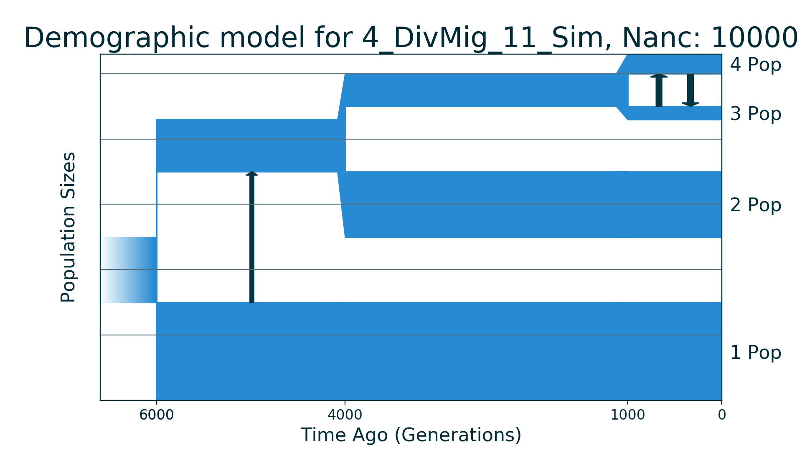
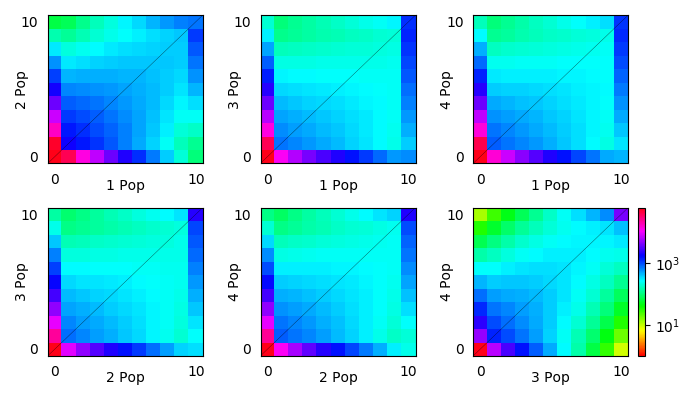

## 4_DivMig_11_Sim

| Number of populations | Number of parameters | Max log likelihood | Size of spectrum |
| --- | --- | --- | --- |
| 4 | 11 | -16932.827 | 10x10x10x10 |

### Model Description

Four population demographic history with 11 parameters. Ancestral population of constant size was split (T1 + T2 + T3) time ago into two new populations. First (1) population has constant size till nowdays. After divergence there was migration to population 1 from another population. The second formed population turned out to be a common population to another three populations: (T2 + T3) time ago it splits and formed so-called population 2 and T3 time ago the second formed population divided into population 3 and population 4. There were almost no migrations between populations except symmetric one between populations 3 and 4.

### Plots

Schematic model plot:

Simulated allele frequency spectrum (projections):

### Optimal parameter values

| Parameter | Value | Description |
| --- | --- | --- |
| `nu1` | 1.500 | Size of population 1 after split of ancestral population. |
| `nu234` | 0.800 | Size of common ancestor population of populations 2, 3 and 4 after split of ancestral population. |
| `nu2` | 1.000 | Size of population 2 after split of common ancestor population of populations 2, 3 and 4. |
| `nu34` | 0.500 | Size of common ancestor population of populations 3 and 4 after division of population 2 from their common ancestor population. |
| `nu3` | 0.200 | Size of population 3. |
| `nu4` | 0.300 | Size of population 4. |
| `m12_anc` | 2.000 | Migration rate to population 1 from common ancestor population of populations 2, 3 and 4. |
| `m34_sym` | 3.000 | Symmetric migration rate between populations 3 and 4. |
| `T1` | 0.100 | Time between ancestral population split, population 1 formation and next split. |
| `T2` | 0.150 | Time between ancestral population of populations 2, 3 and 4 split, population 2 formation and next split. |
| `T3` | 0.050 | Time of ancestral population of populations 3 and 4 split and formations of population 3 and population 4. |

